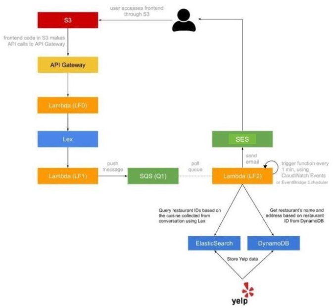

# aws-concierge-bot
In this assignment we implemented a serverless, microservice driven web application. Specifically, we built a Dining Concierge chatbot that sends you restaurant suggestions given a set of preferences that you provide the chatbot with through conversation.
# Demo


# How to dev

## prerequisite
1. Install [remote container](https://marketplace.visualstudio.com/items?itemName=ms-vscode-remote.remote-containers) extension on your VS code. Open this repository folder in VS Code and start the dev environment in container.

2. Create a `.env` with env vars referring inside `dot_env_example`. Then
```bash
source .env
```
## Bring up S3, API gateway, LF0, LF1, and Lex
*NA*

## Bring up SQS, SES, CloudWatch, DynamoDB, OpenSearch, LF2 and scrape data
1. Run `start.sh`
```bash
chmod +x start.sh
./start.sh
```

# Architecture


## Terraform
```bash
# Install terraform packages
terraform init
# see the changes
terraform plan
# reduce the scope
terraform plan -target="<resource>.<resource_name>"
# apply the changes
terraform apply
# delete the changes
terraform destroy
```